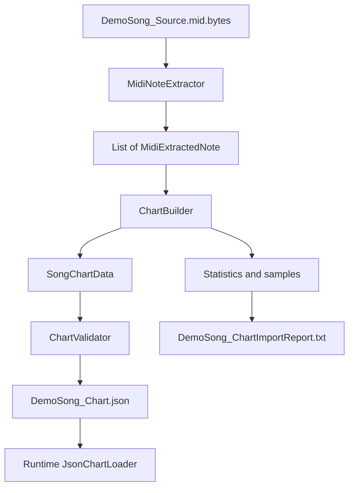

# MIDI Chart Pipeline

## 1. Purpose

Project preprocess MIDI trong Unity Editor để gameplay không phải tự đọc MIDI, loại duplicate hoặc giải quyết chord trong lúc chạy. Editor tạo một JSON nhỏ, deterministic và đã validate; runtime chỉ đọc `lane` cùng `hitTime`.

Gameplay hiện là simplified Magic Tiles và chỉ hỗ trợ một input tại mỗi musical event. Vì vậy invariant quan trọng nhất của chart là:

```text
One unique MIDI Tick group -> exactly one gameplay note
```

## 2. Architecture



```text
SOURCE MIDI + DryWetMIDI
          |
          v
EDITOR: Extractor -> Builder -> Validator -> JSON/Report
-------------------------------------------------------
RUNTIME: JsonChartLoader -> NoteSpawner -> gameplay
```

`ChartBuilder` và `ChartValidator` là pure C#: không phụ thuộc UnityEngine hoặc DryWetMIDI. Runtime migration đã dùng JSON, nhưng runtime code không thuộc phạm vi thay đổi của chart policy này.

## 3. Folder Structure

```text
Assets/
  GameData/
    Source/Midi/DemoSong_Source.mid.bytes
    Generated/Charts/DemoSong_Chart.json
    Reports/DemoSong_ChartImportReport.txt
  Scripts/
    Editor/ChartImport/Midi/
      MidiExtractedNote.cs       Raw Editor-side note model
      MidiNoteExtractor.cs       Reads MIDI tracks and timing
      ChartBuilder.cs            Dedup, group, representative selection, lane mapping
      ChartValidator.cs          Enforces chart invariants
      ChartImportReportWriter.cs Formats import statistics
      MidiChartImporter.cs       Unity menu/orchestration
    Runtime/Chart/
      NoteData.cs
      SongChartData.cs
      JsonChartLoader.cs
Docs/
  MIDI_CHART_PIPELINE.md
```

## 4. Data Models

### MidiExtractedNote

Editor-only raw model:

- `Tick`: absolute MIDI tick.
- `TimeSeconds`: Tick đã convert qua TempoMap.
- `NoteNumber`: MIDI pitch.
- `TrackIndex`: track nguồn.

### NoteData

Runtime model:

- `lane`: lane 0..3.
- `hitTime`: thời điểm hit theo giây.

### SongChartData

JSON root object chứa `List<NoteData> notes`.

Raw MIDI data không phải gameplay chart data. Tick, pitch và track cần cho preprocessing/debug; runtime chỉ cần lane và time.

## 5. Extraction Flow

`MidiNoteExtractor`:

1. Lấy `TempoMap` từ `MidiFile`.
2. Duyệt từng `TrackChunk` và giữ `TrackIndex`.
3. Lấy raw note qua DryWetMIDI `GetNotes()`.
4. Giữ `note.Time` làm Tick.
5. Convert bằng `note.TimeAs<MetricTimeSpan>(tempoMap)`.
6. Lưu `MetricTimeSpan.TotalSeconds` thành `TimeSeconds`.
7. Sort deterministic theo Tick, NoteNumber, TrackIndex.

Extractor chỉ trả lời “MIDI nguồn chứa gì?”. Nó không deduplicate, chọn representative, assign lane hoặc tạo `NoteData`.

## 6. Duplicate Removal

Exact duplicate key là:

```text
(Tick, NoteNumber)
```

TrackIndex không nằm trong key vì cùng pitch tại cùng MIDI event tạo cùng gameplay intent.

Ví dụ thật:

```text
Tick 0, Note 64, Track 1
Tick 0, Note 64, Track 4
```

Sau deduplicate chỉ còn một Note 64. DemoSong có 181 raw notes, loại 29 duplicate và còn 152 unique MIDI notes.

Không dùng `TimeSeconds` làm key vì Tick là integer source-of-truth; seconds là kết quả floating-point conversion.

## 7. Representative Note Selection

Các pitch khác nhau cùng Tick vẫn là source chord/group, không phải duplicate. Tuy nhiên gameplay chỉ phát sinh một note cho mỗi group.

MIDI evidence cho DemoSong:

| Track | Notes | Unique Ticks | Pitch range | Polyphonic Ticks | Interpretation |
|---:|---:|---:|---:|---:|---|
| 1 | 33 | 33 | 60..72 | 0 | Monophonic high-register melody |
| 3 | 33 | 33 | 48..60 | 0 | Lower accompaniment |
| 4 | 86 | 57 | 52..71 | 24 | Dense harmony/rhythm |
| 5 | 29 | 26 | 36..55 | 3 | Bass/lower accompaniment |

Track 1 còn có 27/33 events được duplicate ở track khác, củng cố việc đây là melody line được layer trong arrangement.

Policy deterministic:

1. Sort unique notes trong Tick group theo pitch, rồi TrackIndex.
2. Nếu group có note Track 1, chọn note Track 1.
3. Nếu một source tương lai làm Track 1 polyphonic, chọn pitch cao nhất của Track 1.
4. Nếu Track 1 im lặng, chọn pitch cao nhất toàn group làm top-voice fallback.

Policy không random và không cố xây melody detector tổng quát. Với DemoSong, 33 representatives đến từ Track 1 và 29 dùng fallback.

Ví dụ:

```text
Tick 0 unique pitches: [36, 48, 52, 60, 64]
Track 1 pitch: 64
Representative: pitch 64, Track 1

Tick 384 unique pitches: [55]
Track 1 silent
Representative: highest pitch 55, Track 4

Tick 768 unique pitches: [50, 53, 62]
Track 1 pitch: 62
Representative: pitch 62, Track 1
```

## 8. Lane Assignment

Sau khi mỗi Tick chỉ còn một representative, builder lấy global representative-pitch range và map pitch sang bốn lane:

```text
normalized = (pitch - minPitch) / (maxPitch - minPitch)
lane = round(normalized * 3)
```

Rounding dùng `MidpointRounding.AwayFromZero`. Nếu toàn chart chỉ có một pitch, lane mặc định là 0.

DemoSong có representative range 47..72:

- pitch 47 map về lane 0;
- pitch 55 map về lane 1;
- pitch 64 map về lane 2;
- pitch 72 map về lane 3.

Đây là pitch-based mapping đơn giản: pitch thấp thiên trái, pitch cao thiên phải. Không dùng `noteNumber % 4`, không random và không có collision vì mỗi Tick chỉ tạo một note.

## 9. Validation Rules

`ChartValidator` không cho export bad JSON. Nó kiểm tra:

- chart và notes list không null/rỗng;
- mỗi `NoteData` không null;
- lane trong range 0..3;
- hitTime không âm, NaN hoặc Infinity;
- notes sort không giảm theo hitTime;
- không có hai gameplay notes cùng exact hitTime;
- build context count khớp JSON note count;
- representative count bằng unique Tick group count;
- gameplay note count bằng unique Tick group count;
- không có hai built notes cùng Tick.

DemoSong hiện PASS toàn bộ invariant:

```text
62 unique Tick groups == 62 representatives == 62 gameplay notes
```

## 10. Generated JSON

Importer serialize `SongChartData` bằng Unity `JsonUtility` pretty print:

```json
{
  "notes": [
    {
      "lane": 2,
      "hitTime": 0.0
    }
  ]
}
```

TrackIndex, Tick và NoteNumber không vào runtime JSON. Runtime đã nhận đúng abstraction cuối: lane nào, lúc nào.

## 11. Import Report

Report gồm:

- **SOURCE:** MIDI path.
- **RAW DATA:** track count và raw notes.
- **NORMALIZATION:** duplicate removed và unique MIDI notes.
- **SOURCE GROUP ANALYSIS:** unique Tick groups, multi-pitch groups, largest group.
- **REPRESENTATIVE SELECTION:** policy, total representatives, preferred-track/fallback counts.
- **OUTPUT:** final notes, lane distribution, first/last hit time.
- **REPRESENTATIVE TRANSFORMATIONS:** raw -> dedup -> representative -> output cho ba Tick đầu.
- **VALIDATION:** PASS/FAIL, errors và warnings.

Report không dump toàn bộ notes; nó tập trung vào evidence cần review policy.

## 12. How To Use

Trong Unity Editor:

1. Chọn **Tools -> Magic Tiles -> Build Demo Song Chart**.
2. Chờ log `Validation PASS`.
3. Review `Assets/GameData/Generated/Charts/DemoSong_Chart.json`.
4. Review `Assets/GameData/Reports/DemoSong_ChartImportReport.txt`.
5. Chạy lại menu để xác nhận output deterministic.

Raw diagnostic menu:

**Tools -> Magic Tiles -> Diagnostics -> Preview Raw MIDI Notes**

## 13. Debugging Guide

### Raw note count sai

Kiểm tra MIDI path, TextAsset import, DryWetMIDI parse và track count. DemoSong hiện có 181 raw notes.

### Duplicate count bất thường

Kiểm tra melody có bị layer/copy giữa track hay không. Duplicate key cố ý bỏ qua TrackIndex.

### Final note count khác Tick group count

Đây là validation error. Kiểm tra representative selection và đảm bảo builder chỉ gọi `BuildGameplayNotes` một lần cho mỗi prepared Tick group.

### Melody track thay đổi

Xem track profile trong MIDI diagnostic/report. `PreferredMelodyTrackIndex = 1` là quyết định theo evidence của DemoSong, không phải universal MIDI convention.

### Lane distribution quá lệch

Review representative pitch range. Global min/max mapping giữ pitch meaning nhưng không cam kết số note cân bằng giữa lane.

### JSON rỗng

Validator sẽ FAIL. Kiểm tra extractor output và exception trong Console.

### MIDI/audio timing mismatch

TempoMap giữ MIDI timing, nhưng pipeline không tự đo silence đầu audio hoặc output latency. Phase calibration có thể cần chart offset.

### Output không deterministic

Kiểm tra source MIDI có đổi không. Sort, dedup, preferred-track selection, highest-pitch fallback và lane mapping đều deterministic.

## 14. Design Decisions

- **Preprocessing:** runtime nhận chart sạch, không mang MIDI logic.
- **Tick grouping:** chính xác hơn double seconds.
- **Typed HashSet key:** `(long Tick, int NoteNumber)` rõ nghĩa và không tạo string.
- **One Tick -> one note:** phù hợp simplified single-input Magic Tiles, tránh full horizontal row/multi-touch chord.
- **Track 1 preference:** dựa trên evidence monophonic/high-register của DemoSong.
- **Highest-pitch fallback:** top voice là melody proxy nhỏ và dễ giải thích.
- **Pitch-range lane mapping:** giữ quan hệ thấp-trái/cao-phải mà không modulo/random.
- **Deterministic JSON:** dễ diff, test và reproduce.
- **Pure builder/validator:** dễ test không cần Unity hoặc DryWetMIDI.
- **KISS:** không namespace, asmdef, DI, interface hoặc settings asset.

## 15. Known Limitations

- Track 1 preference là source-specific heuristic; MIDI khác có thể đặt melody ở track khác.
- Highest pitch không phải lúc nào cũng là melody.
- Một Tick có nhiều pitch sẽ mất harmony vì gameplay chỉ giữ một representative.
- Global pitch range có thể tạo lane distribution không cân bằng.
- Pipeline chưa tối ưu hand alternation, difficulty curve hoặc repeated-lane ergonomics.
- Chưa có chart offset/calibration nếu MIDI và audio không cùng origin.
- Production rhythm game thường cần track metadata hoặc chart authoring tool riêng.

## 16. Interview Review

1. **Vì sao preprocess MIDI?**
   Để runtime chỉ đọc chart đã normalize và validate.

2. **Vì sao group bằng Tick?**
   Tick là integer source-of-truth; seconds là kết quả conversion.

3. **Vì sao không deduplicate bằng TimeSeconds?**
   Floating-point time không phù hợp làm exact source key.

4. **Exact duplicate là gì?**
   Cùng Tick và NoteNumber, không phụ thuộc TrackIndex.

5. **Same Tick, khác pitch có phải duplicate không?**
   Không; đó là multi-pitch source group nhưng gameplay chọn một representative.

6. **Vì sao chọn Track 1?**
   Nó monophonic, high-register, 33 note/33 Tick và phần lớn được layer ở track khác.

7. **Fallback khi Track 1 im lặng là gì?**
   Pitch cao nhất trong group, coi như top-voice melody proxy.

8. **Vì sao không xây melody detector tổng quát?**
   Không cần cho home test và sẽ tăng complexity thiếu evidence.

9. **Invariant quan trọng nhất là gì?**
   Final gameplay note count phải bằng unique Tick group count.

10. **Vì sao không dùng `noteNumber % 4`?**
    Modulo không giữ quan hệ pitch thấp/cao và từng gây lane collision.

11. **Lane được tính thế nào?**
    Normalize representative pitch trong global range rồi round sang lane 0..3.

12. **Vì sao output deterministic?**
    Để cùng MIDI tạo cùng JSON, dễ diff và debug.

13. **Vì sao TrackIndex không vào JSON?**
    Nó chỉ phục vụ Editor selection/debug; runtime không cần.

14. **Nếu thêm nhiều song thì cải tiến gì?**
    Đưa preferred track/policy thành import setting và thêm batch tests.

15. **Giới hạn chính của policy hiện tại?**
    Melody selection và lane distribution vẫn là heuristic theo source.
