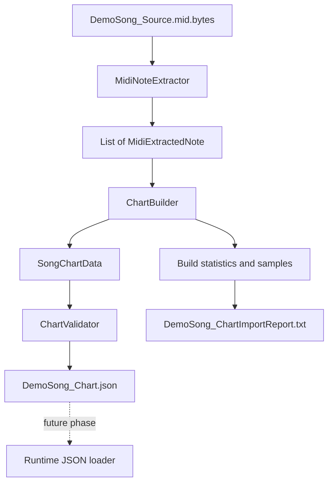

# MIDI Chart Pipeline

## 1. Purpose

Project preprocess MIDI trong Unity Editor để runtime không phải đọc MIDI, tải DryWetMIDI hoặc tự giải quyết duplicate/chord khi gameplay đang chạy. Kết quả preprocessing là JSON nhỏ, deterministic và chỉ chứa dữ liệu gameplay cần dùng.

Lợi ích chính:

- phát hiện lỗi chart trước Play Mode;
- loại bỏ duplicate và lane collision một lần tại import time;
- giữ runtime đơn giản và độc lập với format MIDI;
- tạo report có thể review trong interview hoặc source control.

Phase hiện tại kết thúc ở validated JSON. `Legacy/MidiChartLoader` vẫn được giữ nguyên và runtime chưa đọc JSON.

## 2. Architecture



Ranh giới dependency:

```text
SOURCE MIDI + DryWetMIDI
          |
          v
EDITOR: Extractor -> Builder -> Validator -> JSON/Report
-------------------------------------------------------
RUNTIME (future): JSON -> gameplay chart
```

DryWetMIDI chỉ xuất hiện trong extractor/importer Editor và legacy loader. `ChartBuilder` cùng `ChartValidator` không phụ thuộc UnityEngine hoặc DryWetMIDI.

## 3. Folder Structure

```text
Assets/
  GameData/
    Source/Midi/DemoSong_Source.mid.bytes
    Generated/Charts/DemoSong_Chart.json
    Reports/DemoSong_ChartImportReport.txt
  Scripts/
    Editor/ChartImport/Midi/
      MidiExtractedNote.cs       Raw Editor-side note model
      MidiNoteExtractor.cs       Reads actual MIDI tracks and timing
      ChartBuilder.cs            Dedup, chord limit and lane assignment
      ChartValidator.cs          Enforces generated-chart invariants
      ChartImportReportWriter.cs Formats human-readable statistics
      MidiChartImporter.cs       Unity menu and pipeline orchestration
    Runtime/Chart/
      NoteData.cs                Runtime gameplay note
      SongChartData.cs           JSON root model
    Legacy/
      MidiChartLoader.cs         Existing temporary runtime loader
Docs/
  MIDI_CHART_PIPELINE.md
```

`MidiChartImporter` không chứa chart algorithm. Nó chỉ load source, gọi từng stage, ghi artifact, refresh AssetDatabase và log summary.

## 4. Data Models

### MidiExtractedNote

Editor-only raw model:

- `Tick`: MIDI absolute tick; khóa chính xác cho event grouping.
- `TimeSeconds`: thời gian đã convert bằng TempoMap.
- `NoteNumber`: MIDI pitch.
- `TrackIndex`: track nguồn để debug và ổn định sort.

Model không chứa lane và không bị deduplicate trong extractor. Channel không được thêm vì DemoSong chỉ dùng channel 0, 2, 3 và 4; không có percussion channel 9 và pipeline hiện không lọc theo channel.

### NoteData

Runtime model chỉ có:

- `lane`: lane gameplay 0..3;
- `hitTime`: thời điểm hit theo giây.

### SongChartData

JSON root object chứa `List<NoteData> notes`.

Raw MIDI data không phải gameplay chart data. Track, tick và pitch cần để build/debug, nhưng runtime chỉ cần biết note xuất hiện ở lane nào và lúc nào.

## 5. Extraction Flow

`MidiNoteExtractor` thực hiện các bước sau:

1. Lấy `TempoMap` từ toàn bộ `MidiFile`.
2. Duyệt từng `TrackChunk` và gán `TrackIndex` theo thứ tự source.
3. Lấy note bằng DryWetMIDI `GetNotes()`.
4. Giữ `note.Time` làm absolute MIDI Tick.
5. Convert Tick qua `note.TimeAs<MetricTimeSpan>(tempoMap)`.
6. Lưu `MetricTimeSpan.TotalSeconds` thành `TimeSeconds`.
7. Sort deterministic theo Tick, NoteNumber, TrackIndex.

Extractor trả lời câu hỏi “MIDI nguồn thực tế chứa gì?”. Nó không deduplicate, không xử lý chord, không assign lane và không tạo `NoteData`.

## 6. Duplicate Removal

Exact gameplay duplicate có key typed:

```text
(Tick, NoteNumber)
```

`TrackIndex` không thuộc key. Hai track có cùng pitch tại cùng MIDI event sẽ tạo cùng gameplay intent, nên chỉ giữ event đầu tiên sau deterministic sort.

Ví dụ thật tại Tick 0:

```text
Note 64, Track 1
Note 64, Track 4
```

Sau deduplicate chỉ còn một Note 64. DemoSong có 181 raw notes, loại 29 exact duplicates và còn 152 unique MIDI notes.

Không dùng `TimeSeconds` làm key vì floating-point time là kết quả convert; Tick mới là giá trị source chính xác và ổn định.

## 7. Chord Handling

Các pitch khác nhau cùng Tick là chord, không phải duplicate.

Mỗi Tick group được sort pitch tăng dần:

- nếu có tối đa 4 pitch: giữ tất cả;
- nếu có hơn 4 pitch: chọn đúng 4 pitch trải đều từ thấp đến cao.

Với chord size `N`, bốn source index được tính deterministic:

```text
round(i * (N - 1) / 3), i = 0..3
```

Rounding dùng `MidpointRounding.AwayFromZero`. Policy luôn giữ hai biên thấp/cao và representation ở giữa, thay vì chỉ lấy bốn pitch thấp nhất hoặc chọn random.

Ví dụ Tick 0 sau deduplicate:

```text
[36, 48, 52, 60, 64]
             |
             v
[36, 48, 60, 64]
```

DemoSong có chord lớn nhất 5 pitch. Có 7 group vượt bốn pitch và tổng cộng 7 pitch bị drop.

## 8. Lane Assignment

Lane count là hằng số `ChartBuilder.LaneCount = 4`.

### Chord có từ 2 đến 4 pitch

Pitch đã sort được trải từ trái sang phải. Pitch index `i` trong chord size `C` được map bằng:

```text
lane = round(i * 3 / (C - 1))
```

Kết quả:

- 2 pitch -> lane `[0, 3]`;
- 3 pitch -> lane `[0, 2, 3]`;
- 4 pitch -> lane `[0, 1, 2, 3]`.

Điều này đảm bảo pitch thấp hơn luôn nằm về bên trái pitch cao hơn và không có duplicate lane trong một Tick.

Ví dụ 1, Tick 0:

```text
pitch [36, 48, 60, 64]
lane  [ 0,  1,  2,  3]
```

Ví dụ 2, Tick 768:

```text
pitch [50, 53, 62]
lane  [ 0,  2,  3]
```

### Single note

Single pitch được normalize theo global pitch range của các candidate đã chọn:

```text
normalized = (pitch - minPitch) / (maxPitch - minPitch)
lane = round(normalized * 3)
```

DemoSong dùng candidate range 36..72. Vì vậy single pitch 55 tại Tick 384 map vào lane 2. Trường hợp toàn chart chỉ có một pitch duy nhất map vào lane 0.

Policy này nhỏ, deterministic và tránh hoàn toàn root cause cũ `noteNumber % 4`.

## 9. Validation Rules

`ChartValidator` không export JSON khi có error. Nó kiểm tra:

- build result, chart và notes list không null;
- chart không rỗng;
- mỗi `NoteData` không null;
- lane trong range 0..3;
- hitTime không âm, NaN hoặc Infinity;
- notes sort không giảm theo hitTime;
- không trùng exact `(hitTime, lane)`;
- build context count khớp JSON note count;
- không trùng exact `(Tick, lane)`.

Chord bị giới hạn bốn lane là warning có chủ đích, không phải validation error. DemoSong hiện validation PASS với một warning về 7 pitch bị drop.

## 10. Generated JSON

JSON chỉ serialize `SongChartData` bằng Unity `JsonUtility` pretty print:

```json
{
  "notes": [
    {
      "lane": 0,
      "hitTime": 0.0
    }
  ]
}
```

TrackIndex, Tick và NoteNumber không được đưa vào JSON vì runtime không cần chúng. Giữ JSON nhỏ cũng làm runtime loader tương lai đơn giản hơn và tránh coupling với MIDI.

## 11. Import Report

Report ghi các nhóm statistic sau:

- **SOURCE:** file MIDI được sử dụng.
- **RAW DATA:** số track và raw notes extractor nhìn thấy.
- **NORMALIZATION:** duplicate bị loại và số unique MIDI notes.
- **CHORD ANALYSIS:** số Tick group, chord group, chord lớn nhất, group quá bốn pitch và số pitch bị drop.
- **OUTPUT:** gameplay note count, phân bố bốn lane, first/last hit time.
- **REPRESENTATIVE TRANSFORMATIONS:** raw -> dedup -> lane limit -> pitch/lane cho ba Tick đầu.
- **VALIDATION:** PASS/FAIL, errors và warnings.

Report không dump toàn bộ note list, vì mục đích của nó là review pipeline chứ không thay chart editor.

## 12. How To Use

Trong Unity Editor:

1. Chọn **Tools -> Magic Tiles -> Build Demo Song Chart**.
2. Chờ log `Validation PASS`.
3. Review JSON tại `Assets/GameData/Generated/Charts/DemoSong_Chart.json`.
4. Review report tại `Assets/GameData/Reports/DemoSong_ChartImportReport.txt`.

Diagnostic raw source vẫn có tại:

**Tools -> Magic Tiles -> Diagnostics -> Preview Raw MIDI Notes**

Build cùng một input luôn tạo cùng note order, lane và statistic.

## 13. Debugging Guide

### Raw note count sai

Chạy diagnostic menu. Kiểm tra MIDI asset path, track count, import type TextAsset và DryWetMIDI parse error. Extractor phải thấy 181 raw notes với DemoSong hiện tại.

### Duplicate count bất thường

Kiểm tra source có copy melody giữa nhiều track hay không. Duplicate key cố ý bỏ qua TrackIndex; thay đổi Tick resolution/source quantization có thể đổi kết quả.

### Chord quá lớn

Xem `Groups exceeding 4 pitches`, `Notes dropped` và representative sample trong report. Nếu drop nhiều, source có thể chứa accompaniment không phù hợp hoặc cần authoring policy tốt hơn.

### Same lane/same timestamp

Validator phải FAIL cả `(hitTime, lane)` lẫn `(Tick, lane)`. Kiểm tra lane formula và đảm bảo không sửa `LaneCount` riêng lẻ ở stage khác.

### JSON rỗng

Validator sẽ không cho export chart rỗng. Kiểm tra extractor count và exception trong Console.

### MIDI/audio timing mismatch

So sánh first beat của MIDI và audio waveform. Pipeline giữ timing theo TempoMap nhưng không tự đo audio latency hoặc silence đầu file. Có thể cần chart offset/calibration trong phase sau.

### Output thay đổi giữa hai lần build

Kiểm tra source MIDI có thay đổi hay không. Sort, deduplicate, chord selection và lane mapping hiện đều deterministic; không stage nào sử dụng random.

## 14. Design Decisions

- **Preprocessing thay vì runtime parsing:** chuyển chi phí, dependency và validation sang Editor; runtime nhận data sạch.
- **Tick thay vì double seconds:** Tick là source-of-truth chính xác cho grouping và duplicate key.
- **HashSet typed key:** `(long Tick, int NoteNumber)` rõ nghĩa, nhanh và tránh string allocation.
- **Deterministic generation:** output dễ diff, test và reproduce.
- **JSON thay vì binary/ScriptableObject:** human-readable, dễ review trong home test và không khóa pipeline vào Unity asset serialization.
- **Builder không phụ thuộc DryWetMIDI:** algorithm có thể test với object raw nhỏ mà không phải dựng MIDI file.
- **KISS:** không namespace, asmdef, interface, DI framework hoặc settings asset trong phase này.
- **Warning cho lane-limit drop:** drop là policy hợp lệ nhưng phải visible trong report.

## 15. Known Limitations

- Automatic MIDI-to-chart không biết track nào thật sự là melody quan trọng.
- Source MIDI có thể chứa accompaniment; exact duplicate removal không loại các pitch accompaniment khác nhau.
- Lane mapping là heuristic, chưa tối ưu ergonomics, hand alternation hoặc difficulty curve.
- Chord hơn bốn pitch bắt buộc mất thông tin.
- Single-note lane dựa trên global pitch range nên thay source range có thể đổi lane toàn bài.
- Pipeline chưa có chart offset/calibration nếu MIDI và audio không cùng origin.
- Rhythm game production thường cần chart editor/authoring workflow riêng.
- Runtime JSON loader chưa được implement; legacy loader vẫn hoạt động như trước.

## 16. Interview Review

1. **Vì sao preprocess MIDI?**  
   Để runtime không mang dependency MIDI và chỉ nhận chart đã validate.

2. **Vì sao group bằng Tick?**  
   Tick là integer source-of-truth; seconds là kết quả floating-point conversion.

3. **Vì sao không deduplicate bằng TimeSeconds?**  
   Hai phép convert có thể gặp precision issue; Tick biểu diễn exact MIDI event.

4. **Duplicate được định nghĩa thế nào?**  
   Cùng Tick và cùng NoteNumber, không phụ thuộc TrackIndex.

5. **Vì sao TrackIndex không vào JSON?**  
   Nó chỉ phục vụ source debug; gameplay không dùng track.

6. **Vì sao extractor không assign lane?**  
   Extractor phải phản ánh trung thực source; lane là gameplay policy của builder.

7. **Vì sao builder không phụ thuộc DryWetMIDI?**  
   Để algorithm nhỏ, dễ test và không coupling với parser library.

8. **Same Tick nhưng khác pitch có phải duplicate không?**  
   Không. Đó là chord và được xử lý theo giới hạn bốn lane.

9. **Chord năm pitch được xử lý thế nào?**  
   Chọn bốn pitch trải đều từ thấp đến cao và report một pitch bị drop.

10. **Vì sao không dùng `noteNumber % 4`?**  
    Nó có thể map nhiều pitch của cùng chord vào một lane, tạo collision.

11. **Vì sao output phải deterministic?**  
    Để cùng input cho cùng JSON, dễ diff, debug và review.

12. **Vì sao chọn JSON?**  
    Nó dễ đọc, dễ source-control và đủ đơn giản cho home test.

13. **Validator bảo vệ invariant quan trọng nào?**  
    Lane hợp lệ, time hữu hạn/sorted và không trùng lane tại cùng Tick/time.

14. **Nếu scale lên nhiều song thì cải tiến gì?**  
    Thêm importer chọn asset/settings, batch build, tests và runtime JSON loader có versioning.

15. **Giới hạn lớn nhất của heuristic hiện tại là gì?**  
    Nó không hiểu musical intent hoặc ergonomics như chart authoring thủ công.
